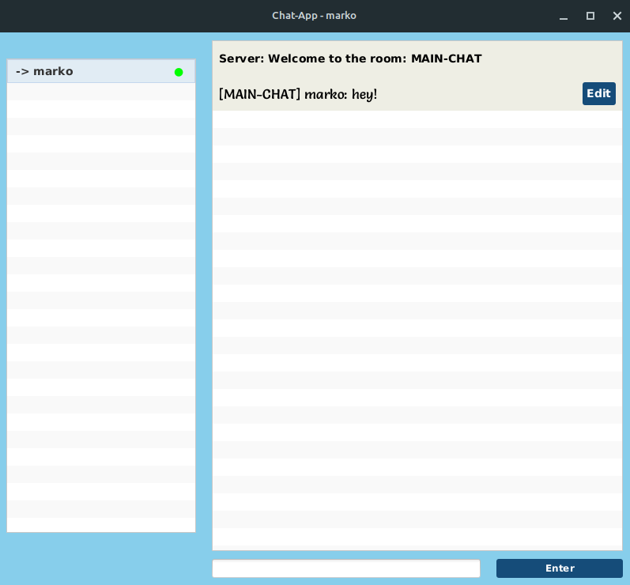

# ChatRooms-Java

## Overview

This is a straightforward chat application. Users can send private messages, create chat rooms, and perform various actions on the chat server.

## Features

- **Private Messaging:** Users can send private messages to each other.

- **Chat Room Creation:** Command to create chat rooms using `Create /room_name`.

- **Invitations to Join Rooms:** Invite other users to join a room with `/Invite room_name username`.

- **List of Chat Rooms:** Users can retrieve a list of all chat rooms with the `/ListRooms` command.

- **Join Chat Room:** Connect to a specific room using the `Join /room_name` command.

- **Message Editing:** Edit previously sent messages with a right-click and notify others.

- **Requesting More Messages:** Users can request additional messages with `GetMoreMessages /chat_room`.

- **Reply Functionality:** Users can reply to messages.

## Login Section

  

## Chat Section

  

## Technologies Used

- **Java:** 
- **JavaFX:** 
- **KryoNet:** Networking library for efficient data exchange using Kryo serialization.

